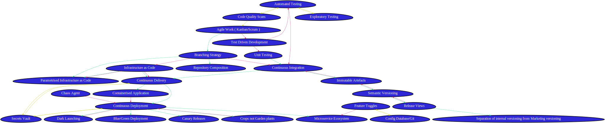

# DevOps-Map

DevOps Map via the magic of Python

## Idea and leaning on the work of

I was looking through the source code of [Warzone 3100](https://github.com/Warzone2100/warzone2100) and found the Tech Tree is mapped out using a Python script to generate an SVG. As I have been looking for an easy way to maintain my DevOps map I thought this might be a solid method. 

Big thank you to Adam Olsen for the original Warzone script that gave me the idea
[WarzoneResearch.py](https://github.com/Warzone2100/warzone2100/blob/3.4.1/tools/tech-tree-chart-generator/warzoneresearch.py)

Big thank you to Neil Kidd and Vasileios Vlachos for your Python support!

## Notes on connections

I have flip flopped on the connection names. I want to keep it simple and have as few edge types as possible to maintain the understanding of the map but some descriptions are better than others.

__The three I have chosen are:__

* Enables  
   Enables is a one way -> edge. This Enables that to work. I considered, enhances but it isn't strong enough. Enables is almost Mandatory in my mind.
* BetterTogetherWith
   This is better together with that. <--> A Bidirectional edge. Both nodes need to match the other for validation. They are both more useful when both are being used. But that does not mean they have to be.
* ReducesFailureOf
   This reduces the failure of that. -> a one way edge. Not mandatory, the *that* can be done without *this* but it is more risky. I have considered changing the term to Increase Confidence In but thought it less accurate. Feel free to share with Sponsors and busines groups the constructed synonym in this context.

## References and Libraries

* [Uses PyDot](https://github.com/pydot/pydot) 
* [Uses JSON built in](https://www.w3schools.com/python/python_json.asp) 
* [Uses Python3 dev container](https://github.com/microsoft/vscode-dev-containers/tree/master/containers/python-3)
* [Invisible edges to change relative location. use this to enable graph to become a map](https://graphviz.org/Gallery/undirected/grid.html)

## Setup for development outside of a DevContainer

```bash
apt-get update && apt-get -y install --no-install-recommends graphviz python3-pip
# cd working directory
pipenv shell
pipenv install pydot pydot-ng
```

## Resulting SVG

